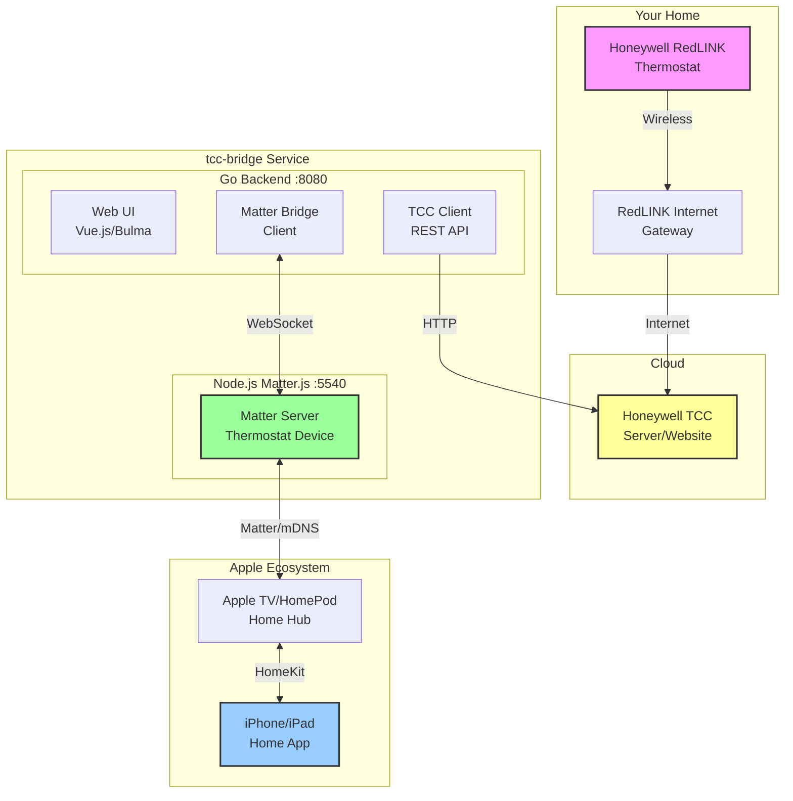

# TCC-Matter Bridge

A service that bridges Honeywell Total Connect Comfort (TCC) thermostats to Apple HomeKit via the Matter protocol.

This works with Honeywell [Redlink thermostats](https://www.resideo.com/us/en/pro/products/air/thermostats/redlink-thermostats/).

## Features

- Control your TCC thermostat from Apple Home app
- Web UI for configuration and monitoring
- Temperature and status updates
- Automatic reconnection and error handling

## Architecture



## Software Requirements

- Node.js 18+
- Go 1.21+
- Network access to TCC cloud service

## Quick Start

### 1. Install Dependencies

```bash
# Install Node.js and Go (on Raspberry Pi)
./scripts/install.sh

# Or manually install dependencies
make install
```

### 2. Build

```bash
make build
```

### 3. Run

```bash
# Development mode
make dev

# Or run directly
./bin/tcc-bridge
```

### 4. Configure

1. Open `http://localhost:8080` in your browser
2. Go to Configuration and enter your TCC credentials
3. Go to Pairing and scan the QR code with your iPhone

## Configuration

The service stores data in `~/.tcc-bridge/`:

- `tcc-bridge.db` - SQLite database
- `encryption.key` - Encryption key for stored credentials

### Environment Variables

- `SERVER_PORT` - HTTP server port (default: 8080)
- `MATTER_PORT` - Matter protocol port (default: 5540)
- `TCC_POLL_INTERVAL` - Polling interval in seconds (default: 600)

## Project Structure

```
tcc-bridge/
├── cmd/server/          # Go entry point
├── internal/
│   ├── config/          # Configuration
│   ├── tcc/             # TCC API client
│   ├── matter/          # Matter bridge client
│   ├── storage/         # SQLite storage
│   ├── web/             # HTTP/WebSocket server
│   └── log/             # Logging
├── matter-bridge/       # Node.js Matter service
├── web/                 # Vue 3 frontend
├── configs/             # Systemd service files
└── scripts/             # Installation scripts
```

## API Endpoints

| Endpoint | Method | Description |
|----------|--------|-------------|
| `/api/status` | GET | System status |
| `/api/thermostat` | GET | Thermostat state |
| `/api/thermostat/setpoint` | POST | Set temperature |
| `/api/thermostat/mode` | POST | Set mode |
| `/api/config` | GET | Configuration status |
| `/api/config/credentials` | POST | Save TCC credentials |
| `/api/pairing` | GET | Matter pairing info |
| `/api/logs` | GET | Event logs |
| `/api/ws` | WS | WebSocket for live updates |

## Deployment

### Docker (Recommended)

Build and push to your registry:

```bash
# Build Docker image
make docker-build

# Push to registry
make docker-push
```

Run with Docker Compose:

```bash
# Start services
make docker-up

# View logs
make docker-logs

# Stop services
make docker-down
```

Or run directly:

```bash
docker run -d \
  --name tcc-bridge \
  -p 8080:8080 \
  -p 5540:5540 \
  -v tcc-data:/app/data \
  --restart unless-stopped \
  stephens/tcc-bridge:latest
```

### Systemd Service

```bash
# Install service
make install-service

# Start service
sudo systemctl start tcc-bridge

# View logs
sudo journalctl -u tcc-bridge -f
```

## Troubleshooting

### TCC Connection Issues

- Verify credentials at mytotalconnectcomfort.com
- Check network connectivity
- TCC rate limits requests; wait 10 minutes between polls

### HomeKit Pairing Issues

- Ensure iPhone and Pi are on the same network
- Reset pairing: delete `matter-bridge/data/` and restart

### Service Won't Start

- Check logs: `sudo journalctl -u tcc-bridge -e`
- Verify Node.js installed: `node --version`
- Verify permissions on data directory

## License

MIT

## Acknowledgments

- [matter.js](https://github.com/project-chip/matter.js) - Matter protocol implementation
- [pyhtcc](https://github.com/csm10495/pyhtcc) - TCC API reference
