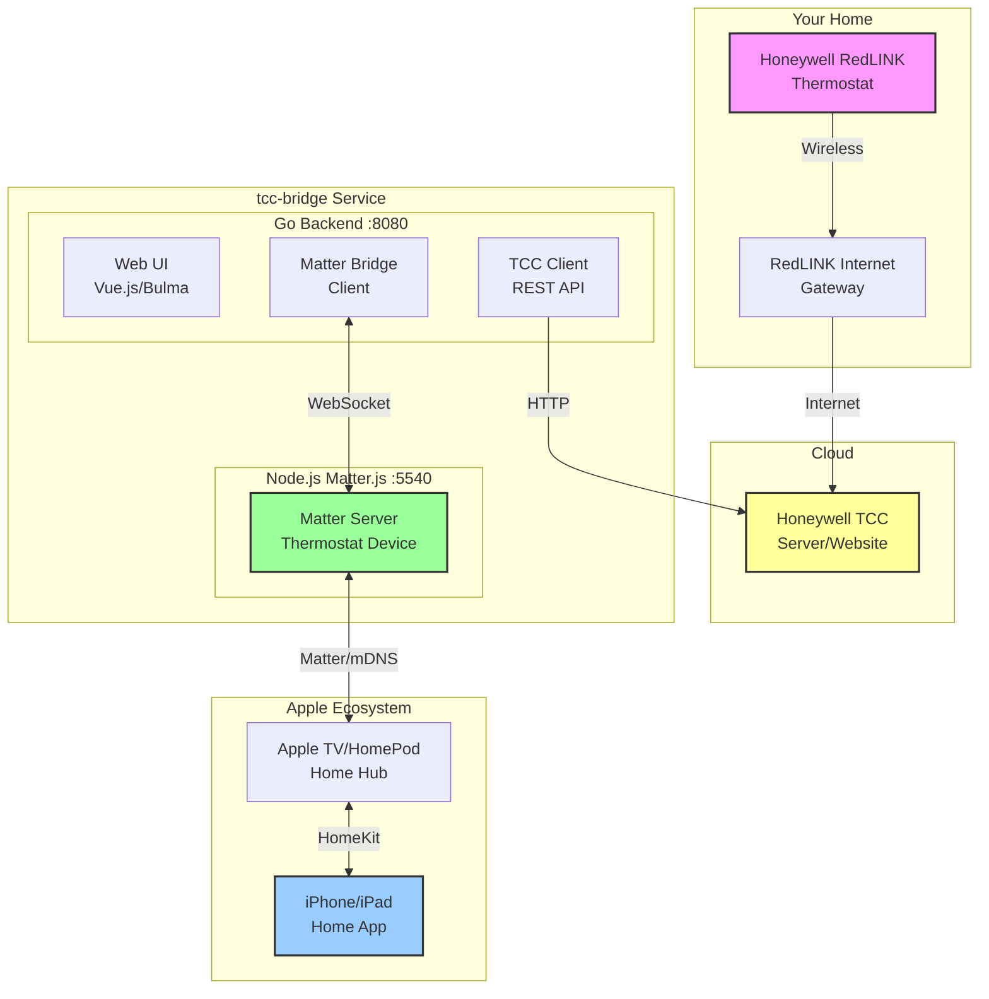

# TCC-Matter Bridge

A service that bridges Honeywell Total Connect Comfort (TCC) thermostats to Apple HomeKit via the Matter protocol.

This works with Honeywell [Redlink thermostats](https://www.resideo.com/us/en/pro/products/air/thermostats/redlink-thermostats/).

## Features

- Control your TCC thermostat from Apple Home app
- Web UI for configuration and monitoring
- Temperature and status updates
- Automatic reconnection and error handling

## Architecture



## Quick Start (Docker)

The easiest way to run tcc-bridge is using the pre-built Docker image:

### 1. Install Docker

```bash
# On Raspberry Pi or Linux
curl -fsSL https://get.docker.com -o get-docker.sh
sudo sh get-docker.sh
sudo usermod -aG docker $USER
```

### 2. Create docker-compose.yml

```yaml
services:
  tcc-bridge:
    image: stephens/tcc-bridge:latest
    container_name: tcc-bridge
    restart: unless-stopped
    network_mode: host
    volumes:
      - ./data:/app/data
    environment:
      - TZ=America/New_York
```

### 3. Start the Service

```bash
docker compose up -d
```

### 4. Configure

1. Open `http://localhost:8080` in your browser
2. Go to **Configuration** and enter your TCC credentials
3. Go to **Pairing** and scan the QR code with your iPhone
4. Your thermostat will appear in the Apple Home app

### View Logs

```bash
docker compose logs -f
```

## Alternative: Run Docker Directly

If you prefer not to use docker-compose:

```bash
docker run -d \
  --name tcc-bridge \
  --network host \
  -v ./data:/app/data \
  -e TZ=America/New_York \
  --restart unless-stopped \
  stephens/tcc-bridge:latest
```

> **Note**: `--network host` is required for Matter/HomeKit mDNS discovery to work properly.

## Building from Source

If you want to build from source instead of using Docker:

### Requirements

- Node.js 18+
- Go 1.21+
- Network access to TCC cloud service

### Build Steps

```bash
# Clone the repository
git clone https://github.com/stephens/tcc-bridge.git
cd tcc-bridge

# Install dependencies
make install

# Build all components
make build

# Run the service
./bin/tcc-bridge
```

For development:

```bash
# Run in debug mode
./bin/tcc-bridge -debug

# Or use the Makefile
make dev
```

## Configuration

The service stores data in different locations depending on how it's run:

**Docker**: `./data/.tcc-bridge/` (in the mounted volume)
**Local**: `~/.tcc-bridge/` (in your home directory)

Data files:
- `tcc-bridge.db` - SQLite database (credentials, state, logs)
- `encryption.key` - Encryption key for stored TCC credentials

### Environment Variables

- `TCC_DATA_DIR` - Data directory path (default: `~/.tcc-bridge`)
- `MATTER_DATA_DIR` - Matter storage path (default: `./data/.matter`)
- `MATTER_BRIDGE_DIR` - Matter bridge code path (default: `./matter-bridge`)
- `TZ` - Timezone (e.g., `America/New_York`)

## Hardware Requirements

- **Recommended**: Raspberry Pi 4 (2GB+ RAM) or any ARM64/x86_64 Linux system
- **Network**: Ethernet or WiFi connection
- **Storage**: 500MB for Docker image + data
- **Apple Home Hub**: Apple TV, HomePod, or iPad (for remote HomeKit access)

## API Endpoints

All endpoints are accessible at `http://localhost:8080` (or your server's IP):

## Project Structure

```
tcc-bridge/
├── cmd/server/          # Go entry point
├── internal/
│   ├── config/          # Configuration
│   ├── tcc/             # TCC API client
│   ├── matter/          # Matter bridge client
│   ├── storage/         # SQLite storage
│   ├── web/             # HTTP/WebSocket server
│   └── log/             # Logging
├── matter-bridge/       # Node.js Matter service
├── web/                 # Vue 3 frontend
├── configs/             # Systemd service files
└── scripts/             # Installation scripts
```

## API Endpoints

| Endpoint | Method | Description |
|----------|--------|-------------|
| `/api/status` | GET | System status |
| `/api/thermostat` | GET | Thermostat state |
| `/api/thermostat/setpoint` | POST | Set temperature |
| `/api/thermostat/mode` | POST | Set mode |
| `/api/config` | GET | Configuration status |
| `/api/config/credentials` | POST | Save TCC credentials |
| `/api/pairing` | GET | Matter pairing info |
| `/api/logs` | GET | Event logs |
| `/api/ws` | WS | WebSocket for live updates |

## Deployment Options

### Docker Hub (Recommended)

Pre-built images are available on Docker Hub:

```bash
# Latest version
docker pull stephens/tcc-bridge:latest

# Specific version
docker pull stephens/tcc-bridge:v1.0.0
```

Use docker-compose.yml (recommended) or run directly as shown in Quick Start section.

### Systemd Service (Build from Source)

If you built from source, you can install as a systemd service:

```bash
# Install service
make install-service

# Start service
sudo systemctl start tcc-bridge

# Enable auto-start on boot
sudo systemctl enable tcc-bridge

# View logs
sudo journalctl -u tcc-bridge -f
```

### Building Custom Docker Images

To build your own Docker image:

```bash
# Build Docker image
make docker-build

# Push to your registry
make docker-push
```

## Troubleshooting

### TCC Connection Issues

- Verify credentials at [mytotalconnectcomfort.com](https://mytotalconnectcomfort.com)
- Check network connectivity
- TCC rate limits requests; wait 10 minutes between polls
- Check logs for rate limit errors: `docker compose logs | grep "rate limit"`

### HomeKit Pairing Issues

- **"Accessory Not Found"**: Ensure `network_mode: host` is set in docker-compose.yml
- Ensure iPhone/iPad and tcc-bridge are on the same network
- Install avahi-daemon on Raspberry Pi: `sudo apt-get install avahi-daemon`
- Reset pairing:
  ```bash
  docker compose down
  rm -rf ./data/.matter/*
  docker compose up -d
  ```

### Docker Issues

- **Container won't start**: Check logs with `docker compose logs`
- **Permission denied on data directory**:
  ```bash
  chmod 777 ./data
  # or
  chown -R 1000:1000 ./data
  ```
- **Port already in use**: Check if another service is using port 8080 or 5540
  ```bash
  sudo lsof -i :8080
  sudo lsof -i :5540
  ```

### Service Won't Start (Systemd)

- Check logs: `sudo journalctl -u tcc-bridge -e`
- Verify Node.js installed: `node --version`
- Verify permissions on data directory: `ls -la ~/.tcc-bridge`

## License

MIT

## Acknowledgments

- [matter.js](https://github.com/project-chip/matter.js) - Matter protocol implementation
- [pyhtcc](https://github.com/csm10495/pyhtcc) - TCC API reference
